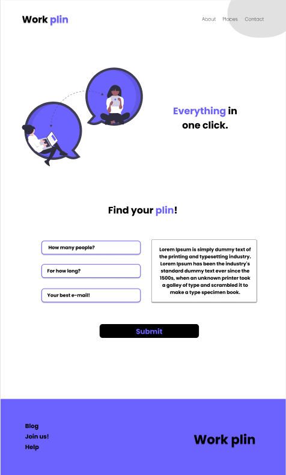

 

  <h3 align="center">Work Plin</h3>

  

    Aqui você encontrará o melhor co-work online!
        
     
    <a href="https://github.com/lubomfim/work-plin">Challenge</a>
    ·
    <a href="https://www.linkedin.com/in/lubomfim">Contact</a>
  

# Welcome :

Esse projeto foi criado para você que está iniciando, assim como eu!   
This project was made for begginers, just like me!

# Challenge

Seu desafio será construir uma página sobre um site de locação de co-work online.   
Your challenge is to build a landing page for a coworking space

# Techs:

HTML 
CSS

# Getting start:

1 - Use esse template ou baixe esse repositório com o código inicial 
2 - Leia as instruções no readme.md 
3 - Comece a codar! 
4 - Compartilhe seu resultado com a comunidade :) 
 

1 - Use this template or download this repository with the starter code 
2 - Read the instructions in readme.md 
3 - Start coding! 
4 - Share your results with the community :) 

# Requirements:

- Sua página deve se parecer o mais próximo possível do design 
- Sua página deve ser responsiva 
   

- Your page should look as close as possible to the visual design. 
- Your page should be responsive 

- Você pode encontrar o design aqui: <a href="https://www.figma.com/file/m95CWMbgT372P5ytrlSluF/Work-Plin?node-id=0%3A1">Figma</a>
- You can find the design here: <a href="https://www.figma.com/file/m95CWMbgT372P5ytrlSluF/Work-Plin?node-id=0%3A1">Figma</a>

# Layout width:

Desktop: 1240px 
Mobile: 320px

# Colors:

Blue: #6C63FF 
Black: #000000

# Design:

Modelo disponível na pasta `./design` 
Imagens disponíveis na pasta `./img` 
 

Design available in `./design` path 
Images available in `./img` path 

# Font family:

- Poppins

# Share!

Initialize your project with this template in your github as a public repository 
Capture a screenshot, gif or video and share your result in Linkedin 
Send me a feedback in <a href="https://www.linkedin.com/in/lubomfim">Linkedin</a>! 

Designed and created by <a href="https://github.com/lubomfim">Lucas</a> :)
